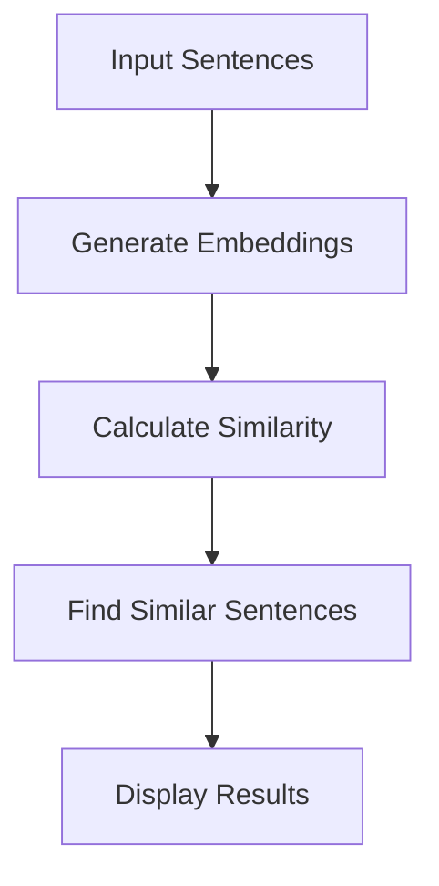

````markdown
<div align="center">

# 🔍 Paraphrase Mining using Sentence Transformers

### 🚀 Detect Semantic Similarity Between Sentences with NLP & Deep Learning

<p align="center">
  
  
  
  
  
</p>

<p align="center">
  
  
</p>

---

⭐ **If you like this project, don't forget to star the repository!**

</div>

---

# 📖 Project Overview

This project demonstrates **Paraphrase Mining** using **Sentence Transformers**, a powerful NLP library for generating semantic sentence embeddings.

Instead of comparing words, the model understands the **meaning** of each sentence and identifies whether two sentences express the same idea.

This project is ideal for learning modern **Natural Language Processing (NLP)** techniques and semantic similarity analysis.

---

# ✨ Key Features

- ✅ Semantic Sentence Embeddings
- ✅ Paraphrase Detection
- ✅ Cosine Similarity Calculation
- ✅ Duplicate Sentence Identification
- ✅ Fast & Efficient NLP Pipeline
- ✅ Beginner-Friendly Notebook

---

# 🧠 Project Workflow

```text
Input Sentences
      │
      ▼
Sentence Transformer Model
      │
      ▼
Sentence Embeddings
      │
      ▼
Cosine Similarity
      │
      ▼
Paraphrase Mining
      │
      ▼
Most Similar Sentence Pairs
```

---

# 🛠️ Tech Stack

| Technology | Purpose |
|------------|---------|
| 🐍 Python | Programming Language |
| 📒 Jupyter Notebook | Development Environment |
| 🤖 Sentence Transformers | Text Embeddings |
| 🔥 PyTorch | Deep Learning Backend |
| 📊 NumPy | Numerical Computing |
| 🐼 Pandas | Data Handling |

---

# 📂 Project Structure

```text
📦 Paraphrase-Mining
│
├── 📒 Paraphrase_Mining.ipynb
├── 📄 README.md
├── 📋 requirements.txt
└── 📁 dataset (optional)
```

---

# 🚀 Installation

## Clone Repository

```bash
git clone https://github.com/saurabh73198-lang

cd paraphrase-mining
```

## Install Dependencies

```bash
pip install sentence-transformers torch pandas numpy
```

## Launch Notebook

```bash
jupyter notebook Paraphrase_Mining.ipynb
```

---

# ⚙️ How It Works



---

# 📊 Applications

| Domain | Use Case |
|---------|----------|
| 🤖 Chatbots | Intent Matching |
| 🔎 Search Engines | Semantic Search |
| 📚 Education | Duplicate Assignment Detection |
| 📰 News | Similar Article Detection |
| 🛒 E-commerce | Product Recommendation |
| 💬 Social Media | Duplicate Content Detection |

---

# 📈 Expected Output

The notebook returns:

- Sentence Pair 1
- Sentence Pair 2
- Similarity Score
- Ranked Paraphrases

Example:

```text
Sentence A:
A man is eating food.

Sentence B:
Someone is having a meal.

Similarity Score:
0.94
```

---

# 🎯 Skills Demonstrated

- Natural Language Processing
- Semantic Search
- Deep Learning
- Sentence Embeddings
- Python Programming
- Machine Learning
- Data Analysis

---

# 📚 Future Improvements

- Add Web Application using Streamlit
- Upload Custom Dataset
- Real-time Sentence Comparison
- Interactive Dashboard
- REST API Integration
- Hugging Face Deployment

---

# 🤝 Contributing

Contributions are always welcome!

```text
Fork 🍴
   ↓
Create Branch 🌿
   ↓
Commit Changes 💻
   ↓
Push 🚀
   ↓
Open Pull Request 🎉
```

---

# 👨‍💻 Author

## **Saurabh Kumar**

🎓 BCA Student

💻 Python | Data Analytics | Machine Learning | NLP

🌱 Always Learning New Technologies

---

<div align="center">

## ⭐ Support

If you found this project useful,

### 🌟 Please give this repository a Star!

Made with ❤️ using Python & Sentence Transformers

</div>
````
